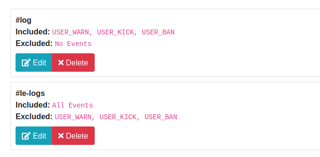

# Modlogs

KirBot offers extensive and highly granular moderation logging capabilities. Modlogs can be
configured across an unlimited number of channels, and each channel's log events are independently
managed.

Modlog configuration is done via the [Web Admin Panel](../panel/general.md#logging).

## Modlog Channels

Channels are considered modlog channels when log events are sent as a result of various actions taken
by the user or automatically by the bot. A server can have an unlimited amount of modlog channels.

Events that are logged include, but are not limited to, message edits, message deletes, role 
manipulations, kicks, bans, and much more.

_In order for modlogs to function correctly, KirBot keeps a record of every message that is sent on
your server. If you do not want this, do not add this bot to your server or do not give KirBot
permission to view the channel._

### Event Filtering

Each modlog channel can have its own independent filters. The filter operates in two modes: Whitelist
and Blacklist. When events are whitelisted, _only_ those events will be logged in this channel. When
events are blacklisted, every event _except_ those blacklisted will be logged in the channel

#### Example Scenario

A server administrator wants to have two mod log channels: One for general logging, and one for kicks
and bans.

The admin would create two channels on discord, log into the panel, and add both of those channels as
modlog channels.

When filtering events, they select the following: 

* For the general purpose logging channel, they **blacklist** USER_KICK, USER_BAN, and USER_WARN,
 leaving the whitelist blank. This ensures all log events except USER_KICK, USER_BAN and USER_WARN are
logged to the channel.
* For the infraction logging channel, they **whitelist** USER_KICK, USER_BAN, and USER_WARN, leaving
the blacklist blank. This ensures that only USER_KICK, USER_BAN and USER_WARN are the only events logged.

On the panel, their log channels could look like this:

In this case, `#log` is their infraction tracking channel while `#le-logs` is their general purpose
modlog channel.