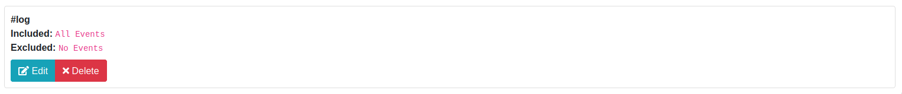
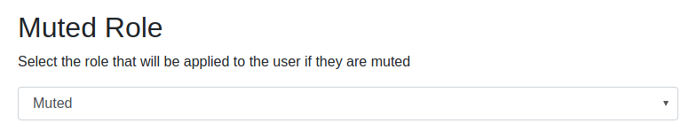
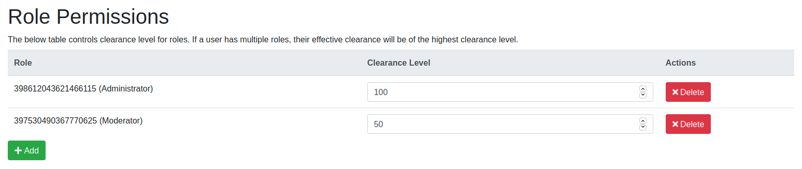
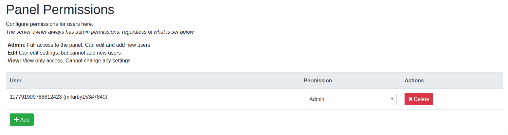

# Quick Start
This guide will get you up and running quickly, from inviting KirBot to your server to configuring mod logs and other administrative tasks

## 1. Invite the Bot
Add the bot to your server by clicking [here](https://kirbot.mrkirby153.com/invite).

## 2. Log into the admin panel
Log into the admin panel and select the server you just added the bot to by clicking [here](https://kirbot.mrkirby153.com/servers).
After logging in, select the server you want to configure.

You will be asked to connect your account with Discord in order to log into the panel. 
This ensures you only see the servers that you have access to configure.

## 3. Set up Modlogs
In the General tab, add a modlog channel by selecting it from the "Add Channel" dropdown.

Modlog channels default to logging everything. If you don't want that, click the "Edit" button on
the channel's settings and select the log events that you wish to include/exclude from the channel.

Added a channel you didn't mean to by mistake? Click the "Delete" button twice to confirm the deletion
of the log channel. Deleting the log channel wil _not_ delete modlog messages that were sent

Additionally, you can configure the log timezone to localize modlog timestamps to your server's timezone.
By default, it's set to UTC,  but you can change it to any valid timezone such as `PST` or `America/Los_Angeles`.

## 4. Configure the muted role

For Mutes to function correctly, KirBot needs to know which role you will be using.

Select the role that you wish to use as your "Muted" role from the dropdown

## 5. Configure Clearances
By default, everyone aside from the server owner has a clearance of 0, meaning they can only run
commands that have a clearance level of 0 or less. For a full list of commands, see [here](commands.md).

On the "Permissions" tab, click the "Add" button under the "Role Permissions" heading. Select the role
that you want to set clearance for from the dropdown and enter the clearance for the role in the box.
Finally, save the clearance setting by clicking the Save button.

To modify the clearance of a role that already has clearance set, edit the clearance level next to it.

**Note:** If a user has more than one role with a configured clearance, their effective clearance will
be the highest clearance level. For more details, see [Clearance](clearance.md).

## 6. Add other users to the panel
If you want other people besides yourself to be able to configure the bot through the panel, you
need to add their user ids to the panel. 

While on the "Permissions" tab, click the "Add" button under 
the "Panel Permissions" heading. Enter the user id of the user you wish to add to the panel,
set their desired permission level and hit Save. The user will then be able to visit the
[Server List](https://kirbot.mrkirby153.com/servers) and select the server.

To change a user's permission level, select their new level from the dropdown. Changes are saved
automatically.

**Note:** Even if a user has "Edit" permissions, they cannot modify their own permission level.

## Getting Additional Help

If you need additional help, join the [Support Server](https://kirbot.mrkirby153.com/join).